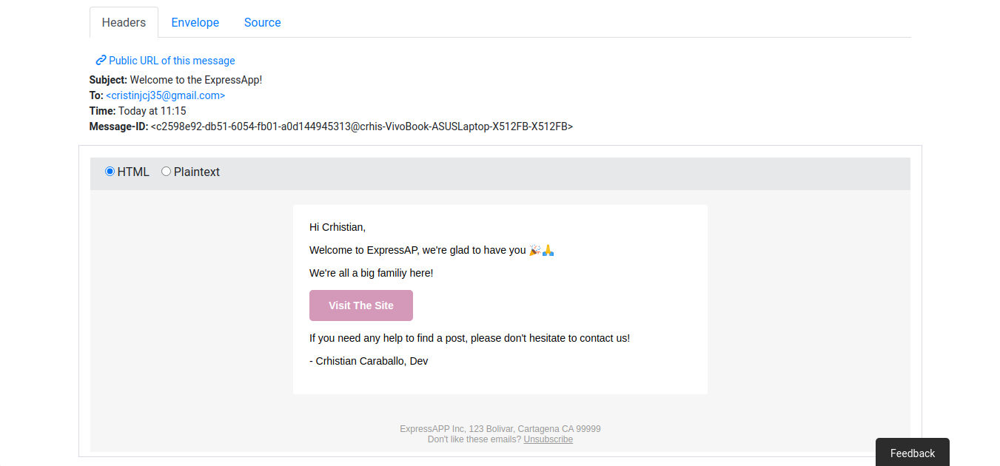

# Express REST API Docs

## Configurations

Before start you should have some configurations setups.

- Create and config.env file as follow inside *src/* folder.


```dosini
JWT_SECRET=holaquepasachavales
JWT_EXPIRES_IN=91d
JWT_COOKIE_EXPIRES_IN=91
NODE_ENV=development
EMAIL_FROM=ExpressApp
EMAIL_HOST=smtp.ethereal.email
EMAIL_PORT=587
EMAIL_USERNAME=ila.sauer@ethereal.email
EMAIL_PASSWORD=MfmF91xWHWvrDX7MuP
```

I recomment set NODE_ENV to production but you can use development as well.

- Updating and config.json file inside *src/* folder as follow.

> I've been used postgres so you can change database gestore to then you have to install their npm [packcages](https://sequelize.org/master/manual/getting-started.html) and change the dialect and user with password.

```json
{
  "development": {
    "username": "crhis",
    "password": "admin",
    "database": "prueba",
    "host": "127.0.0.1",
    "dialect": "postgres"
  }
}
```
## Database 

Change directory to *src/* and inside you could execute sequelize commands

```sh
sequelize db:create
sequelize db:migrate
```
If you do not have sequelize you could use npx

```sh
npx sequelize db:create
npx sequelize db:migrate
```


## Installation

```sh
npm install 
npm run build
npm start
```

Or

```sh
yarn install
yarn build
yarn start
```

### Emails

You could use [Ethereal](https://ethereal.email/) for recived messages.

## Open Endpoints

> Showing production errors.
> All getAll Enpoints are paginate you could use limits and offset to controll data response

Open endpoints require no Authentication.

* [Login](./docs/login.md) : `POST /api/v1/users/login`

* [SignUp](./docs/signup.md) : `POST /api/v1/users/signup`
  
## Endpoints that require Authentication

Closed endpoints require a valid Token to be included in the header of the
request. A Token can be acquired from the Login view above.

### Current User related

Each endpoint manipulates or displays information related to the User whose
Token is provided with the request:

* Get All Users: `GET /api/v1/users`
* Get One User: `GET /api/v1/users/:id`
* Update User: `PATCH api/v1/users/:id`
* Delete User:`DELETE api/v1/users/:id`

### Category related

Endpoints for viewing and manipulating the Categories that the Authenticated User
has permissions to access.

* Get All Categories: `GET /api/v1/categories`
* Post Category: `POST /api/v1/categories`
* Get Number of Post From One Category: `GET /api/v1/categories/:id/resume`
* Get All Posts with Comments Of One Category: `GET /api/v1/categories/:id`
* Update Category: `PATCH api/v1/categories/:id`
* Delete Category:`DELETE api/v1/categories/:id`

### Post related

Endpoints for viewing and manipulating the Posts that the Authenticated User
has permissions to access.

* Get All Categories: `GET /api/v1/posts`
* Create a Post Given A Category: `POST /api/v1/categories/:cateoryId/posts`
* Get One Posts: `GET /api/v1/posts/:id`
* Get Count Of Visits Posts: `GET /api/v1/posts/:id/time`
* Update Category: `PATCH api/v1/posts/:id`
* Delete Category:`DELETE api/v1/posts/:id`

### Comments related

Endpoints for viewing and manipulating the Comments that the Authenticated User
has permissions to access.

* Get All Comments: `GET /api/v1/comments`
* Create a Comment For A Post: `POST /api/v1/posts/:postId/comments`
* Get One Comments: `GET /api/v1/comments/:id`
* Update Comment: `PATCH api/v1/comments/:id`
* Delete Comment:`DELETE api/v1/comments/:id`

# Emails

> Welcome email



> Post visit count every hour at 50


> Note I did not use passportJs because I just like to use when I have to do a google Auth 

